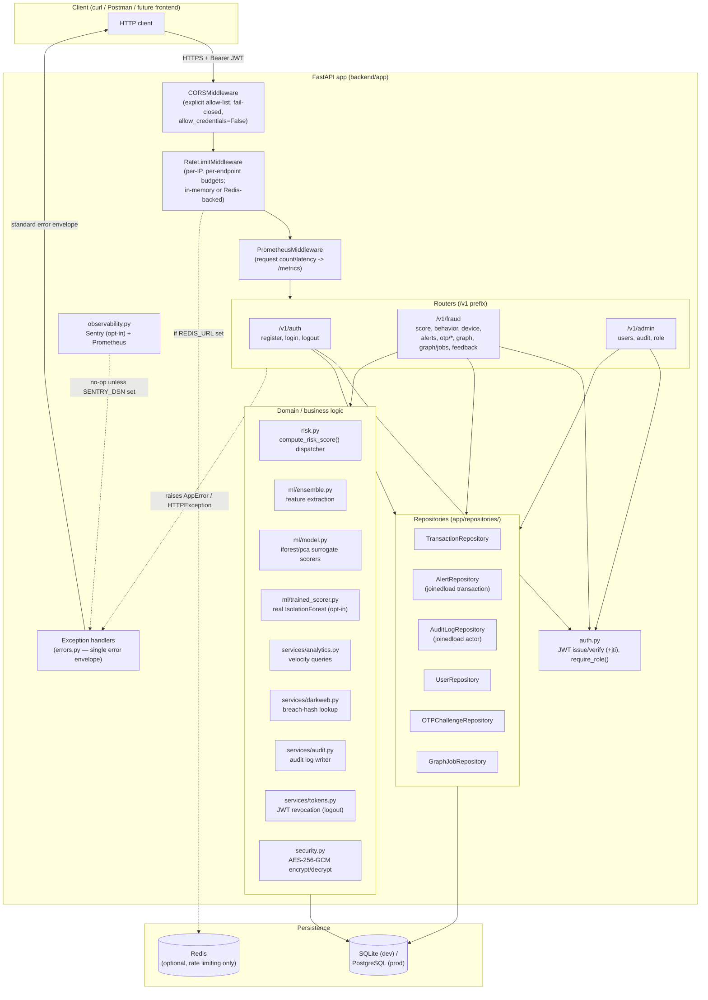
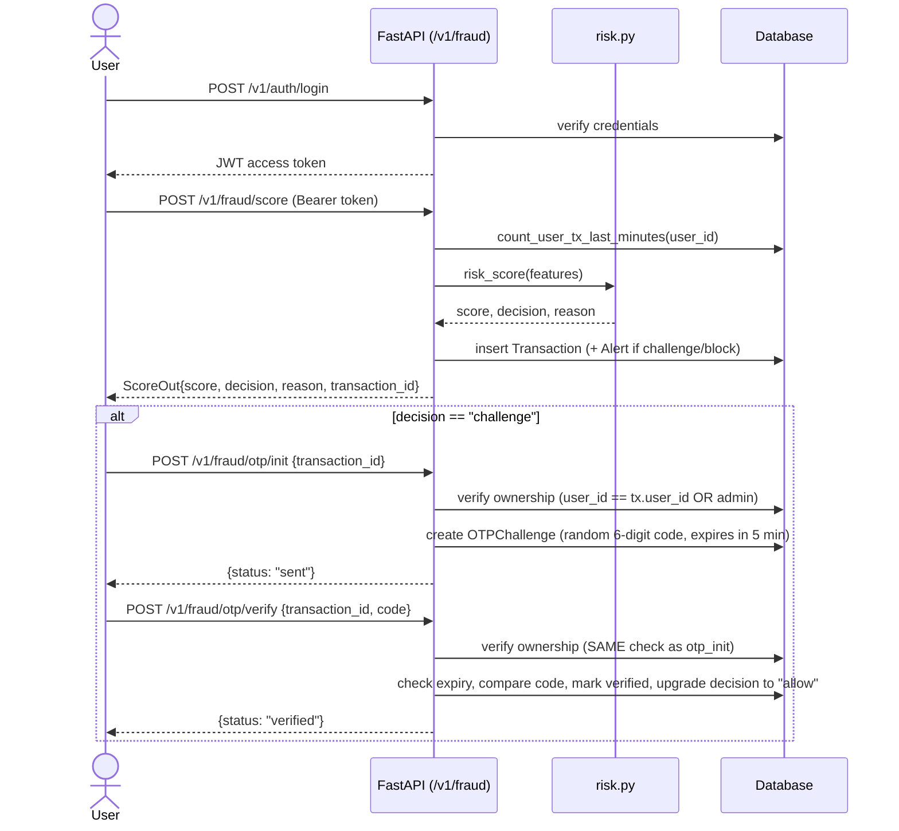
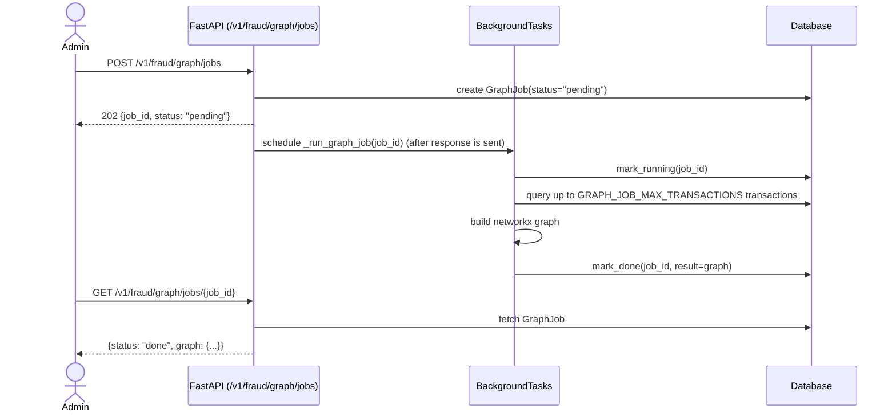

# Architecture

FraudGuard is a single FastAPI backend service (no frontend — see
[README: What's Mocked vs. Real](../README.md#whats-mocked-vs-real)) that
scores transactions for fraud risk using a heuristic rules-based engine,
enforces role-based access control, and exposes an OTP-based step-up
authentication flow for medium-risk transactions.

## Component diagram

## Request flow: transaction scoring + step-up auth

## Request flow: async fraud-ring graph job

## Known limitations (see README for full list)

- No frontend exists; every diagram above is a backend-only system.
- The default scoring in `risk.py`/`ml/` is a hand-tuned heuristic, not a
  trained model — see README "What's Mocked vs. Real." An opt-in trained
  `IsolationForest` (`ml/trained_scorer.py`) exists with a real evaluation
  report (`docs/ml_evaluation.md`), trained on synthetic (not real) data.
- Rate limiting is in-memory by default, with an optional Redis-backed
  shared limiter (`REDIS_URL`) — see `docs/adr/0004-rate-limiting.md`.
- The fraud-ring graph has both a synchronous, paginated path
  (`GET /fraud/graph`, portfolio-scale) and an async background-job path
  (`POST /fraud/graph/jobs`, up to `GRAPH_JOB_MAX_TRANSACTIONS`).
