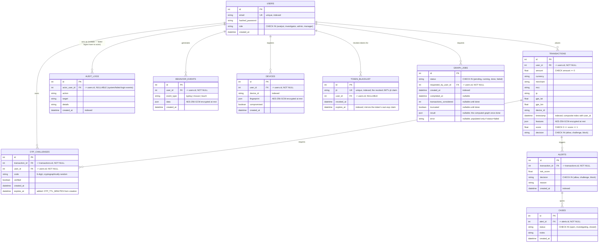

# Entity-Relationship Diagram

Generated from the actual SQLAlchemy models in `backend/app/models.py`
(source of truth — if this ever drifts from the code, the code wins).

## Notes on constraints added during the remediation pass

Every `user_id`/`actor_user_id` column is now a real `ForeignKey` (the
original schema had these as plain, unconstrained `Integer` columns —
referential integrity was not enforced at the database level). `CASE`
columns (`role`, `decision`, `status`) are restricted to their valid value
sets via `CheckConstraint`, not just a Python comment. `amount` and `score`
have range constraints. See `backend/migrations/versions/` for the
executable migration and `backend/app/models.py` for the ORM definitions.

## Tables added after the initial migration

- **`OTP_CHALLENGES.expires_at`** (migration `ba66accbbf9e`) — closes the
  "OTP challenges never expire" finding; enforced in
  `routers/fraud.py::otp_verify`.
- **`TOKEN_BLACKLIST`** (migration `eba17c8732ad`) — backs server-side JWT
  revocation (logout); see `services/tokens.py` and `auth.py::get_current_user`.
- **`GRAPH_JOBS`** (migration `fb2d63b85ad8`) — backs the asynchronous
  fraud-ring graph computation; see `routers/fraud.py::create_graph_job`/
  `_run_graph_job`.

Each was added as an incremental migration (not folded into the original
baseline), consistent with real-world practice once a schema has any
possibility of existing deployments — see `backend/migrations/versions/`
for each migration's `upgrade()`/`downgrade()`, both exercised by
`tests/test_migrations.py`.
